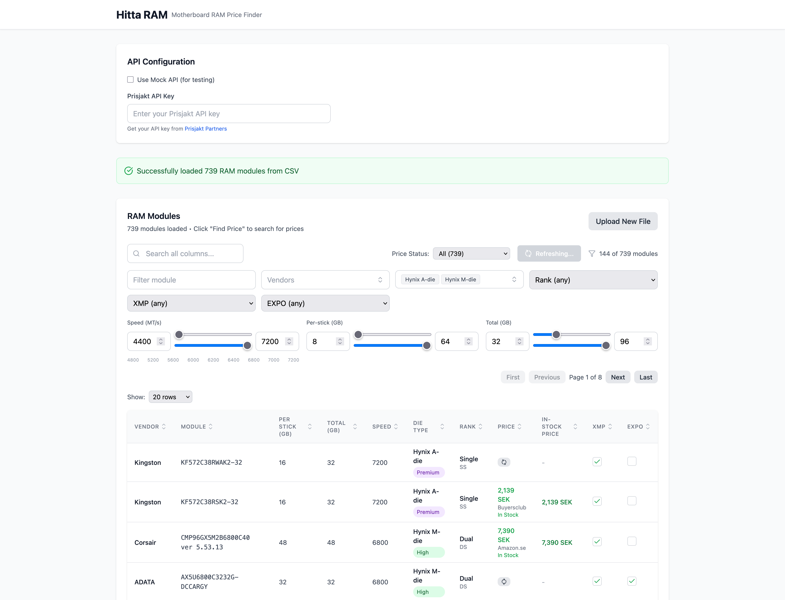

# Hitta RAM - Motherboard RAM Price Finder

A Next.js web application that helps you find and compare RAM module prices from Swedish retailers via Prisjakt API.

## Features

- 📊 **CSV Upload**: Upload RAM module data from CSV files
- 🔍 **Smart Search**: Search and filter RAM modules by specifications
- 💰 **Price Comparison**: Find current prices from Swedish retailers
- 🎯 **Advanced Filtering**: Filter by speed, capacity, die type, rank, and more
- 📱 **Responsive Design**: Works on desktop and mobile devices

## Quick Start

1. **Install dependencies**:
   ```bash
   bun install
   ```

2. **Run development server**:
   ```bash
   bun run dev
   ```

3. **Open your browser**:
   Navigate to `http://localhost:3000`

## Usage

1. Upload a CSV file with RAM module data
2. Configure your Prisjakt API key (optional - uses scraping fallback)
3. Use filters to narrow down your search
4. Click "Find Price" to get current prices from Swedish retailers

## Tech Stack

- **Framework**: Next.js 15
- **Runtime**: Bun
- **Styling**: Tailwind CSS
- **Data**: CSV parsing with PapaParse
- **API**: Prisjakt integration
- **Deployment**: Cloudflare Workers

## API Configuration

The app supports both:
- **Prisjakt API**: Official API with key (recommended)
- **Web Scraping**: Fallback method when no API key is provided

Get your API key from [Prisjakt Partners](https://www.prisjakt.nu/partners/).

## Development

```bash
# Install dependencies
bun install

# Run development server
bun run dev

# Build for production
bun run build

# Deploy to Cloudflare
bun run deploy
```

## Screenshot 
